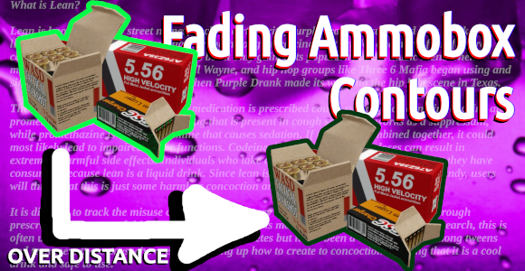
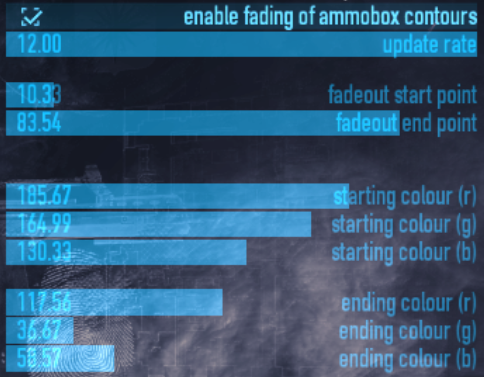
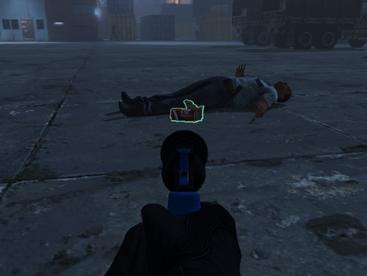
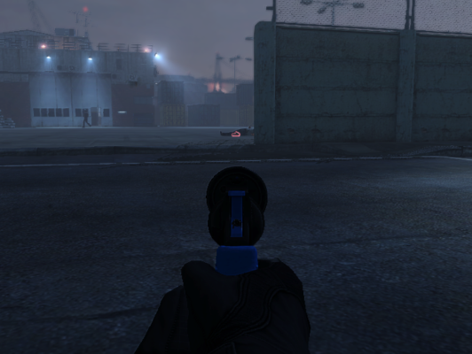

# fading-ammobox-contours

this mod makes ammoboxes have contours that fade out with distance.

also adds an abundance of settings to change where when and how the boxes will fade.

----

  
<b>compatibility</b>

  touches no sync code so should be good as client and host, and shouldnt break with updates or other mods

  might be dodgy when ran with [Fading Contour](https://pd2mods.z77.fr/fading_contour.html)

  
<b>f.a.q.</b>

**Q: will this mark me as a cheater?**

A: no, it will not.

**Q: can this work if I'm not hosting?**

A: this mod works as client and host.

**Q: will this sync to other players**

A: no, this mod is entirely clientsided.

  
<b>localisation credits</b>

**English**

* theokrueger (me)

please submit localisations!

## mirrors

[Gitlab](https://gitlab.com/theokrueger-mods/pd2-fading-ammobox-contours)

[Github](https://github.com/theokrueger-mods/pd2-fading-ammobox-contours)

[ModWorkshop](https://modworkshop.net/mod/37310)

## previews

## license

MIT, see [LICENSE](./LICENSE)
